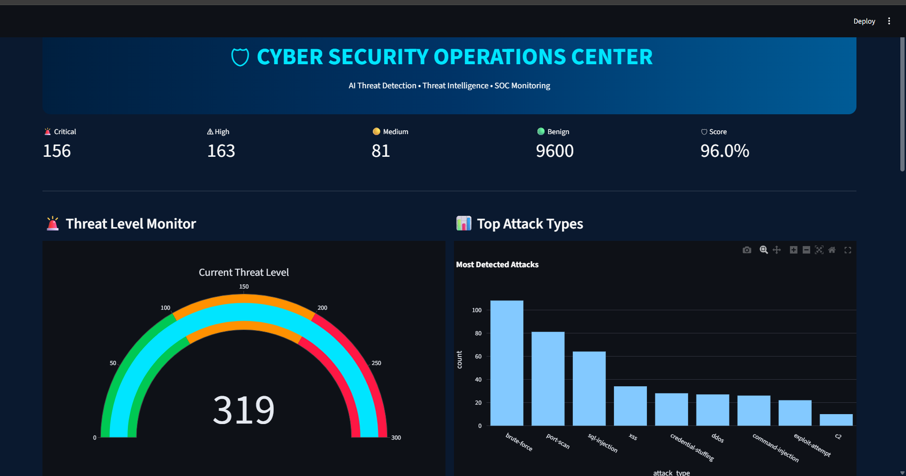
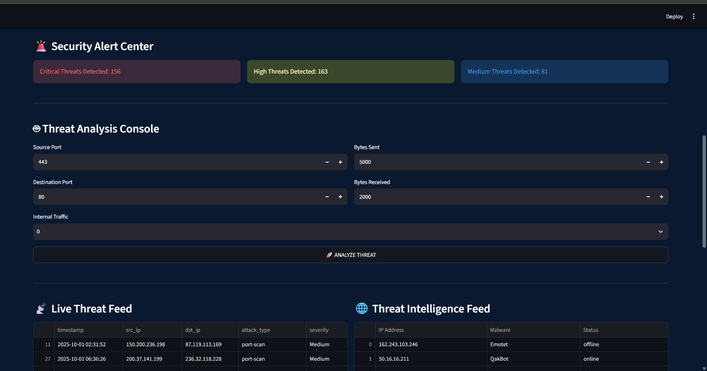
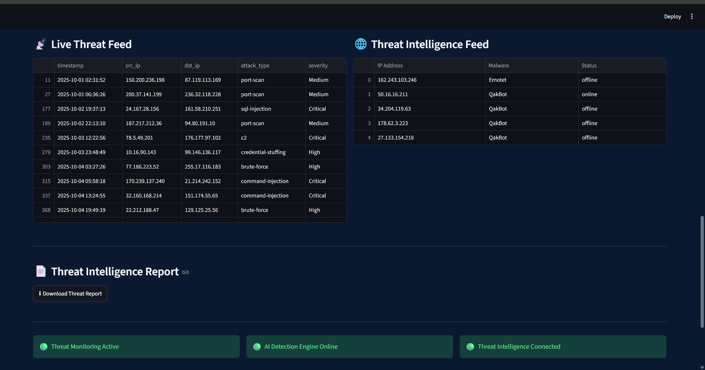

# 🛡️ AI-Powered Cyber Threat Intelligence & SOC Platform

An AI-driven Cyber Security Operations Center (SOC) dashboard designed to detect, analyze, and monitor cyber threats using Machine Learning, Threat Intelligence Feeds, and Interactive Security Analytics.

---

## 🚀 Features

### 🤖 AI Threat Detection
- Machine Learning based threat classification
- Detects malicious network traffic
- Identifies suspicious behavior patterns

### 🚨 Threat Severity Analysis
- Critical Threat Detection
- High Threat Detection
- Medium Threat Detection
- Benign Traffic Classification

### 📊 SOC Dashboard
- Security Score Monitoring
- Threat Level Gauge
- Attack Analytics
- Security Alert Center
- Live Threat Feed

### 🌐 Threat Intelligence Integration
- External Threat Intelligence Feed
- Malicious Infrastructure Monitoring
- Threat Monitoring Dashboard

### 📄 Threat Reporting
- Downloadable Threat Intelligence Reports
- Security Recommendations
- Incident Monitoring Summary

---

## 🛠️ Technology Stack

| Technology | Purpose |
|------------|----------|
| Python | Backend Development |
| Pandas | Data Processing |
| Scikit-Learn | Machine Learning |
| Streamlit | Interactive Dashboard |
| Plotly | Data Visualization |
| Joblib | Model Loading |
| Threat Intelligence APIs | External Threat Feed |

---

## 🏗️ Architecture

```text
Network Traffic Data
          ↓
Data Preprocessing
          ↓
Machine Learning Model
          ↓
Threat Detection
          ↓
Severity Classification
          ↓
SOC Dashboard
          ↓
Threat Intelligence Feed
          ↓
Threat Intelligence Report
```

---

## 📸 Dashboard Preview

### SOC Dashboard


### Threat Analysis Console


### Threat Intelligence Feed


---

## 📂 Project Structure

```text
AI-Cyber-Threat-Intelligence-SOC-Platform
│
├── app.py
├── train_model.py
├── severity.py
├── threat_feed.py
├── requirements.txt
│
├── data
│   └── cybersecurity.csv
│
├── models
│   └── threat_model.pkl
│
└── screenshots
```

---

## ⚙️ Installation

Clone repository:

```bash
git clone https://github.com/manepallineha/AI-Cyber-Threat-Intelligence-SOC-Platform.git
```

Install dependencies:

```bash
pip install -r requirements.txt
```

Run application:

```bash
streamlit run app.py
```

---

## 🎯 Future Enhancements

- Real-Time Network Packet Analysis
- Threat Prediction using Deep Learning
- Malware Classification Module
- SIEM Integration
- Threat Hunting Dashboard
- Automated Incident Response

---

## 👩‍💻 Author

Manepalli Neha Gandhi

Cyber Security Student 

GitHub:
https://github.com/manepallineha

---

## ⭐ Project Highlights

- AI-Powered Threat Detection
- Cyber Security Operations Center (SOC) Dashboard
- Threat Intelligence Integration
- Interactive Security Analytics
- Resume-Ready Cybersecurity Project
